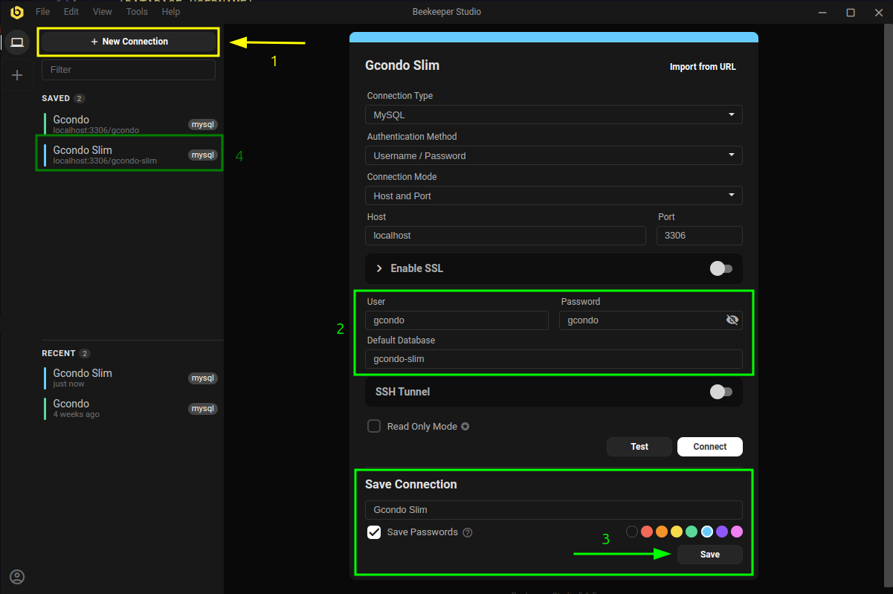

# Gcondo Slim ⚡️

Este projeto é dedicado à etapa técnica do processo seletivo de novos desenvolvedores, tanto front-end quanto back-end.

> [!IMPORTANT]
> **Aviso para colaboradores Gcondo** \
> A *branch* `main` não deve ser enviada para os candidatos. \
> O repositório possui *branches* dedicadas para os processos seletivo de front-end e back-end.

## Ambiente de desenvolvimento local

Por padrão, os candidatos recebem o projeto como um arquivo compactado.

> [!TIP]
> Você pode usar qualquer sistema operacional, seja ele **Windows** ou **Linux**.\
> Essa é a magia do **Docker** 🐳

### Requisitos

- Uma ferramenta para descompactar o arquivo compactado, como **WinRAR** ou **7-Zip**
- Uma **IDE**, como **Visual Studio Code**
- **Docker** e **Docker Compose**

### Sugestões

- Uma ferramenta para acessar e visualizar o banco de dados do projeto, como **Beekeeper**
  - 
- Extensões para o **Visual Studio Code**
  - [Docker](https://marketplace.visualstudio.com/items?itemName=ms-azuretools.vscode-docker)
  - [PHP Intelephense](https://marketplace.visualstudio.com/items?itemName=bmewburn.vscode-intelephense-client)
  - [Error Lens](https://marketplace.visualstudio.com/items?itemName=usernamehw.errorlens)
  - [Markdown All in One](https://marketplace.visualstudio.com/items?itemName=yzhang.markdown-all-in-one)

### Instalação

1. Descompactar o arquivo compactado em um local de sua escolha
2. Acessar o local escolhido no passo anterior
3. Inicializar os containers
    ```bash
    docker compose up -d
    ```
4. Acessar o container da **API**
    ```bash
    docker compose exec api bash
    ```   
5. Instalar as dependências com **Composer**
    ```bash
    composer install
    ```   
6. Configurar o banco de dados com **Phinx**
    ```bash
    composer run phinx:migrate
    ```

**A API estará disponível em http://localhost:8080 e o front-end em https://localhost:5100 ⚡️**

#### Como derrubar os containers?

```bash
docker compose stop
```

#### Como subir os containers novamente?

```bash
docker compose up -d
```

### Insomnia

> [!NOTE]
> Você pode usar outras ferramentas, como **Postman**, mas sugerimos **fortemente** que use o **Insomnia**, já que a coleção está pronta e configurada, facilitando muito o seu trabalho.

1. Abra o **Insomnia**
2. Clique em **"Create"** e escolha **"File"** -> **"Import"** -> **"From File"**
3. Selecione o arquivo `insomnia.json` localizado neste diretório.
  
Todas as rotas estarão disponíveis para teste 💫

## Funcionalidades 🧵

O produto possui dois módulos, sendo eles:

### Condomínios 🏘️

Condomínios possuem os campos *Nome*, *CEP* e *URL*, além das seguintes funcionalidades:

- Criar um condomínio
- Buscar um condomínio
- Listar condomínios
- Editar um condomínio
- Excluir um condomínio
  - Não é possível excluir um condomínio que possui unidades

### Unidades 🏠️

Condomínios possuem os campos *Condomínio*, *Nome*, *Metros quadrados (opcional)*, *Quantidade de quartos (Opcional)*, além das seguintes funcionalidades:

- Criar uma unidade
- Buscar uma unidade
- Listar unidades
- Editar uma unidade
- Excluir uma unidade

## Tecnologias 🛠️

O repositório possui dois diretórios principais, sendo `server` para a **API REST** e `client` para uma **Single Page Application (SPA)**, que consome a **API REST**.

### Servidor 📚️

- PHP 8.4
- Slim 4.12
- Phinx 0.15
- Eloquent 12.0

### Cliente 💻️

- React 19
- Ant Design 5
- TypeScript 5
- Dayjs 1
- React Router 7
- Vite

## Tarefas

A ideia do teste é adicionar novas funcionalidades, corrigir alguns *bugs* e melhorar algumas validações.

> [!TIP]
> Imagine que as tarefas abaixo estão sendo passadas para você pelo coordenador da equipe, ou seja, uma pessoa que não é um desenvolvedor, então não espere informações super técnicas vindo dele.
> 
> Faz parte do teste e do próprio dia a dia de um desenvolvedor traduzir informações não técnicas para informações técnicas e agir com base nisso.

> [!IMPORTANT]
> Lembre-se de que você não deve alterar o código do diretório `server` 🔥

### 1. Melhorar tratamento para validação de CEP de um condomínio

Felizmente, o back-end está validando, mas uma mensagem em inglês está sendo entregue para os usuários, deixando eles preocupados.

Precisamos resolver isso.

### 2. Adicionar a possibilidade de criar unidades e vincular as unidades em condomínios

O back-end já está pronto e já temos as rotas documentadas, estando pendente apenas o desenvolvimento front-end.

> [!TIP]
> *Olá, tudo bem? Eu sou um desenvolvedor front-end Gcondo e vou te dar algumas dicas:*
> 
> Lembre-se que você não precisa reinventar a roda, porque já temos referências prontas no projeto.

### 3. Adicionar indicadores na página inicial

Os indicadores são:

- Quantidade total de condomínios
- Quantidade total de unidades
- Top 5 maiores unidades por metro quadrado
- Top 5 maiores unidades por quantidade de quartos

Não é o ideal, mas por enquanto podemos ir com as rotas que já temos prontas, mesmo que a performance não seja perfeita.

> [!TIP]
> Você pode sugerir e implementar indicadores extras ✨

## Processo

Como parte do nosso processo de desenvolvimento, você deve usar o arquivo `tasks.md` para a *issue review*, ou seja, escrever o que você deve fazer e como deve fazer para concluir estes itens.

 Um desenvolvedor front-end Gcondo será responsável por revisar, então você pode usar termos técnicos, além de trechos de código e *wireframes* (rascunhos) para amostras de telas.

> [!TIP]
> Você pode usar o **Claude** para gerar *wireframes*, usando um *prompt* parecido com:
>
> `Você é um assistente de UX especializado em usar TailwindCSS e React.js para construir wireframes com base no design do Ant Design.`
> 
> É possível até mesmo inserir imagens das telas atuais (já implementadas) e usar isso para construir *wireframes* mais parecidos com o resultado final.
> 
> É claro que você pode também usar o Figma, mas caso faça isso, por favor adicione nas tarefas o *link* ou um *print* do resultado.

> [!IMPORTANT]
> Você deve fazer o desenvolvimento dos itens com base no que você mesmo escreveu em `tasks.md`, então cuidado com isso ⚡️

> [!TIP]
> Como é a sua primeira vez, você pode editar o arquivo `tasks.md` a qualquer momento.
